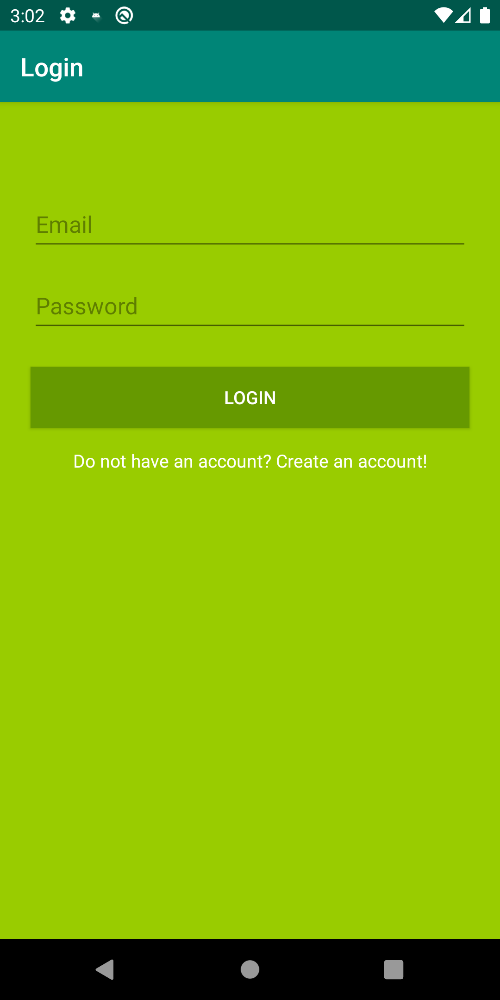
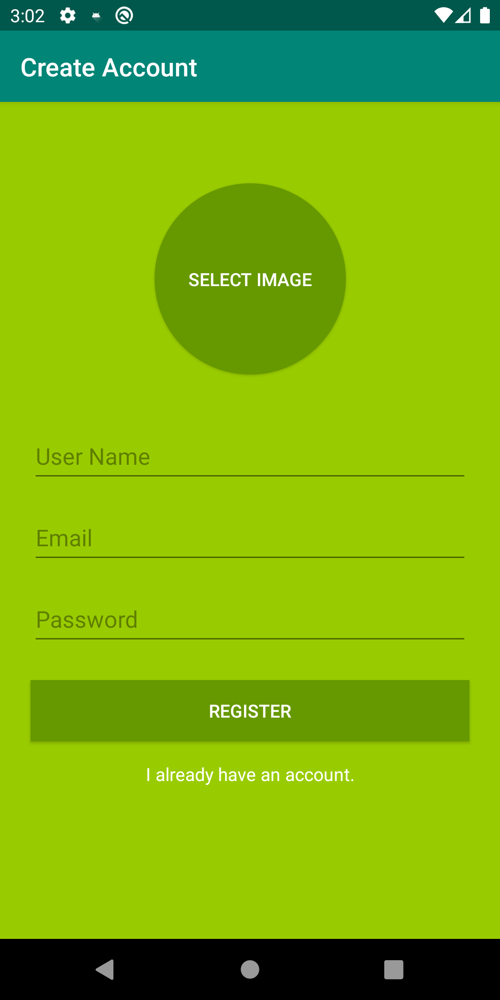

# Kotlin Messenger Android
A messenger developed on Android - Kotlin. The basis of this project was the following video:
https://www.youtube.com/playlist?list=PL0dzCUj1L5JE-jiBHjxlmXEkQkum_M3R-

### Overview
I am creating a fully functional chat messaging app for Android. I connected the user interface on the screens with text views, editing, buttons and user authentication with Firebase.


### Screenshots
Login | Create Account | Select User | Conversation
--- | --- | --- | ---
 |  |  | 

## Licence
Copyright 2019 Daniel Freitas Vilha
```
Permission is hereby granted, free of charge, to any person obtaining a copy
of this software and associated documentation files (the "Software"), to deal
in the Software without restriction, including without limitation the rights
to use, copy, modify, merge, publish, distribute, sublicense, and/or sell copies
of the Software, and to permit persons to whom the Software is furnished to do so,
subject to the following conditions:

The above copyright notice and this permission notice shall be included in all
copies or substantial portions of the Software.

THE SOFTWARE IS PROVIDED "AS IS", WITHOUT WARRANTY OF ANY KIND, EXPRESS OR
IMPLIED, INCLUDING BUT NOT LIMITED TO THE WARRANTIES OF MERCHANTABILITY,
FITNESS FOR A PARTICULAR PURPOSE AND NONINFRINGEMENT. IN NO EVENT SHALL
THE AUTHORS OR COPYRIGHT HOLDERS BE LIABLE FOR ANY CLAIM, DAMAGES OR OTHER
LIABILITY, WHETHER IN AN ACTION OF CONTRACT, TORT OR OTHERWISE, ARISING FROM,
OUT OF OR IN CONNECTION WITH THE SOFTWARE OR THE USE OR OTHER DEALINGS IN THE
SOFTWARE.
```